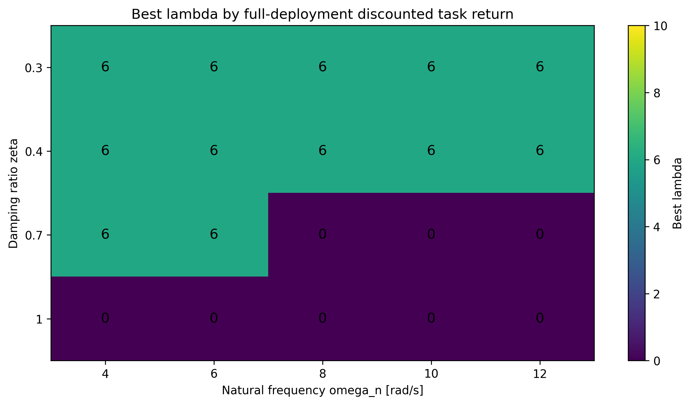

# 2D Quadrotor Reduced-to-Full Transfer Learning in safe-control-gym

This folder contains the experiment files for reduced-to-full transfer learning on a 2D quadrotor navigation task using safe-control-gym for full deployment.

The reduced model is used for training. The full deployment step evaluates the trained reduced policy on the safe-control-gym 2D quadrotor through an attitude inner loop. The policy is not retrained during deployment.

## Folder contents

```text
code/
  quadrotor_transfer/
  scripts/
    train_eval_plot_onefile.py
    run_lambda_sweep_onefile.py
    deploy_existing_lambda_models_full_meanstd.py
    plot_mean_std_from_trajectory_csv.py

data/
  eval_fixed333_start_m3_1_radius025.npy

models/
  F3731/

results/
  reduced_training_evaluations/
  deployment_zeta03/
  deployment_zeta04/
  deployment_zeta07/
  deployment_zeta1/
```

## Task

The task is navigation in the x-z plane.

The workspace used in the final experiment is

$$
x \in [-4,4], \qquad z \in [0,8].
$$

The target is

$$
(x_g,z_g)=(3,7).
$$

The training initial state distribution is

$$
x_0 \sim \mathrm{Uniform}(-3.5,-2.5),
\qquad
z_0 \sim \mathrm{Uniform}(0.5,1.5),
$$

and

$$
\dot{x}_0,\dot{z}_0 \sim \mathrm{Uniform}(-1,1).
$$

For final reduced evaluation and full deployment, the same fixed set of 333 initial states is used for all policies and all deployment settings. The fixed initial states are sampled in a radius-0.25 disk centered at \((-3,1)\), with velocities sampled uniformly from \([-1,1]\). The file is

```text
data/eval_fixed333_start_m3_1_radius025.npy
```

## Reduced model

The reduced state is

$$
s_t = [x_t,\dot{x}_t,z_t,\dot{z}_t,\theta^\star_{t-1}].
$$

The normalized policy action is

$$
a_t = [a^T_t,a^\theta_t] \in [-1,1]^2.
$$

It is mapped to a thrust correction and an attitude reference by

$$
\Delta T_t = \Delta T_{\max} a^T_t,
\qquad
\theta^\star_t = \theta_{\max} a^\theta_t.
$$

In the reduced model, the attitude is assumed to track the command immediately:

$$
\theta_t = \theta^\star_t.
$$

The commanded total thrust is

$$
T_t = mg + \Delta T_t.
$$

The reduced translational dynamics are

$$
\ddot{x}_t = \frac{T_t}{m}\sin(\theta^\star_t),
\qquad
\ddot{z}_t = \frac{T_t}{m}\cos(\theta^\star_t)-g.
$$

The policy uses a fixed horizon of 600 steps.

## Reward and training objective

The task reward is

$$
r^{\mathrm{task}}_t
= -\frac{(x_t-x_g)^2+(z_t-z_g)^2}{100}
+ 10\,\mathbf{1}\{d_t \leq 0.15\},
$$

where

$$
d_t = \sqrt{(x_t-x_g)^2+(z_t-z_g)^2}.
$$

The training reward is

$$
r^{\mathrm{train}}_t
= r^{\mathrm{task}}_t
- \lambda |\theta^\star_t-\theta^\star_{t-1}|.
$$

For \(\lambda=0\), the training reward is the task reward. For positive \(\lambda\), the same task reward is used, with a penalty on attitude-reference variation.

The tested lambda values are

```text
0, 2, 4, 6, 8, 10
```

## Full deployment model

The reduced policy is deployed on the full safe-control-gym 2D quadrotor. The policy still outputs

$$
[\Delta T_t,\theta^\star_t].
$$

The attitude is no longer replaced by \(\theta^\star_t\). The full model has attitude dynamics. A second-order inner-loop controller is used to track \(\theta^\star_t\).

The inner-loop parameters are

$$
\omega_n \in \{4,6,8,10,12\},
\qquad
\zeta \in \{0.3,0.4,0.7,1.0\}.
$$

The attitude reference derivative is estimated by a filtered backward difference. The controller gains are

$$
K_p = I_{yy}\omega_n^2,
\qquad
K_d = 2I_{yy}\zeta\omega_n.
$$

The desired attitude acceleration is

$$
\ddot{\theta}^{\mathrm{des}}_t
= \frac{K_p(\theta^\star_t-\theta_t)+K_d(\dot{\theta}^{\star}_t-\dot{\theta}_t)}{I_{yy}}.
$$

The commanded thrust is

$$
T_t = mg + \Delta T_t.
$$

The attitude command is converted to a motor-pair thrust difference by

$$
\Delta T^{\mathrm{pair}}_t
= \frac{I_{yy}\ddot{\theta}^{\mathrm{des}}_t\sqrt{2}}{L}.
$$

The motor-pair thrusts are

$$
T_{1,t}=\frac{1}{2}\left(T_t-\Delta T^{\mathrm{pair}}_t\right),
\qquad
T_{2,t}=\frac{1}{2}\left(T_t+\Delta T^{\mathrm{pair}}_t\right).
$$

The resulting motor-pair thrusts are clipped to the safe-control-gym physical action bounds. For this run, the logged bounds were approximately

```text
T_i in [0.056323, 0.296683] N
hover pair thrust = 0.132435 N
Delta T_max = 0.152223 N
theta_max = 35 deg = 0.610865 rad
```

## Outputs

Reduced-model training and final evaluation outputs are stored in

```text
results/reduced_training_evaluations
```

Each lambda run contains files such as

```text
training_eval_curve.csv
final_evaluation_summary.json
final_evaluation_trajectory.csv
mean_std_final_trajectory_plots/
```

The trained policy artifacts are stored in

```text
models/F3731
```

Each lambda run contains

```text
final_model.zip
vecnormalize.pkl
```

Full deployment outputs are stored in

```text
results/deployment_zeta03
results/deployment_zeta04
results/deployment_zeta07
results/deployment_zeta1
```

Each deployment folder contains

```text
full_deployment_summary.csv
summary_expected_cumulative_task_reward_vs_omega_n.png
summary_discounted_theta_variation_vs_omega_n.png
summary_theta_variation_sum_vs_omega_n.png
summary_final_distance_vs_omega_n.png
summary_success_rate_vs_omega_n.png
```

## Reproducing the lambda sweep

From the safe-control-gym repository root:

```powershell
$ROOT="C:\Users\rabiei\My Research\safe-control-gym"
$EXP="$ROOT\experiments\2D_quadrotor_transfer_learning_safety_control_gym"
Set-Location $ROOT
$env:PYTHONPATH="$EXP\code;$ROOT"

python "$EXP\code\scripts\run_lambda_sweep_onefile.py" `
  --lambda_values 0 2 4 6 8 10 `
  --out_root "$EXP\results\reduced_training_evaluations" `
  --model_root "$EXP\models\F3731" `
  --total_timesteps 1000000 `
  --eval_every 50000 `
  --eval_rollouts 100 `
  --final_rollouts 333 `
  --final_init_states_path "$EXP\data\eval_fixed333_start_m3_1_radius025.npy" `
  --x_bound 4 `
  --z_min 0 `
  --z_max 8 `
  --x_goal 3 `
  --z_goal 7 `
  --init_x_low -3.5 `
  --init_x_high -2.5 `
  --init_z_low 0.5 `
  --init_z_high 1.5 `
  --init_x_dot_low -1 `
  --init_x_dot_high 1 `
  --init_z_dot_low -1 `
  --init_z_dot_high 1 `
  --reward_scale 100 `
  --target_radius 0.15 `
  --target_bonus 10 `
  --max_steps 600
```

## Reproducing full deployment

Example for \(\zeta=0.7\):

```powershell
$ROOT="C:\Users\rabiei\My Research\safe-control-gym"
$EXP="$ROOT\experiments\2D_quadrotor_transfer_learning_safety_control_gym"
Set-Location $ROOT
$env:PYTHONPATH="$EXP\code;$ROOT"

python "$EXP\code\scripts\deploy_existing_lambda_models_full_meanstd.py" `
  --lambda_values 0 2 4 6 8 10 `
  --omega_n_values 4 6 8 10 12 `
  --zeta 0.7 `
  --n_rollouts 333 `
  --init_states_path "$EXP\data\eval_fixed333_start_m3_1_radius025.npy" `
  --model_root "$EXP\models\F3731" `
  --out_root "$EXP\results\deployment_zeta07" `
  --x_bound 4 `
  --z_min 0 `
  --z_max 8 `
  --x_goal 3 `
  --z_goal 7 `
  --init_x_low -3.5 `
  --init_x_high -2.5 `
  --init_z_low 0.5 `
  --init_z_high 1.5 `
  --init_x_dot_low -1 `
  --init_x_dot_high 1 `
  --init_z_dot_low -1 `
  --init_z_dot_high 1 `
  --reward_scale 100 `
  --target_radius 0.15 `
  --target_bonus 10 `
  --max_steps 600
```

Use the same command with `--zeta 0.3`, `--zeta 0.4`, and `--zeta 1.0`, changing the output folder to `deployment_zeta03`, `deployment_zeta04`, and `deployment_zeta1`.

<!-- BEST_LAMBDA_HEATMAP_START -->

## Deployment choice from the lambda sweep

The heatmap below selects, for each inner-loop setting, the reduced-policy lambda that gives the highest full-deployment discounted task return.

The best lambda depends on the quality of the inner-loop attitude response. For low damping and slower tracking, lambda = 6 dominates. For well-damped and fast inner loops, the unconstrained policy can be tracked well enough that lambda = 0 often gives the highest return.



The numerical table used to generate this figure is saved in igures/best_lambda_by_discounted_task_return.csv.

<!-- BEST_LAMBDA_HEATMAP_END -->

